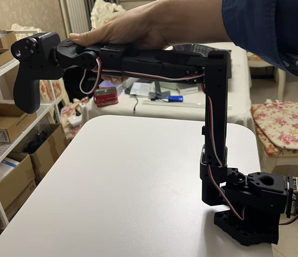

# AlohaMini — 完整工作流程

> **前置条件：** 先完成 [install.md](install.md)（安装与配置）。
> **硬件配置档：** 见 [profiles.md](profiles.md)。

双臂方案 —— PC（客户端）+ 树莓派（主机端），位于同一局域网内。

---

## 1. 系统架构

```
┌──────────────────────────────┐        局域网      ┌──────────────────────────────────┐
│         PC (客户端)           │ ◄───────────────► │        树莓派 (主机端)             │
│                              │                   │                                  │
│  • 主手臂 Leader（USB）       │                   │  • 从手臂 Follower（USB）          │
│  • calibrate_bi.py           │                   │  • 底盘轮子 + 升降轴（USB）         │
│  • teleoperate_bi.py         │                   │  • 摄像头（USB）                   │
│  • record_bi.py              │                   │  • alohamini_host.py             │
│  • 训练 / 评估                │                   │                                  │
└──────────────────────────────┘                   └──────────────────────────────────┘
```

两台机器必须在同一局域网内，且都装好完整环境。

---

## 2. 端口配置

每次只插入一个设备，然后运行：

```bash
lerobot-find-port
# 或者直接查看：
ls /dev/ttyACM*
```

**从手臂** —— 在树莓派上编辑 `src/lerobot/robots/alohamini/config_alohamini.py`：

```python
@dataclass
class AlohaMiniConfig(RobotConfig):
    left_port:  str = "/dev/ttyACM0"   # 替换为左臂总线的实际端口
    right_port: str = "/dev/ttyACM1"   # 替换为右臂总线的实际端口
```

**主手臂** —— PC 端脚本使用下面这些稳定的设备别名：

```python
left_arm_config  = SOLeaderConfig(port="/dev/am_arm_leader_left", ...)
right_arm_config = SOLeaderConfig(port="/dev/am_arm_leader_right", ...)
```

按 [commands.md 中的说明](commands.md#persistent-arm-ports)配置相应的 udev 别名。如果你使用其他路径，请在 `calibrate_bi.py`、`teleoperate_bi.py` 和 `record_bi.py` 中保持一致。

> 重新插拔或重启后端口号可能变化。如果你购买的是整套 AlohaMini，树莓派上的从手臂端口已通过 udev 规则固定 —— 无需额外操作。

## 3. 摄像头配置

```bash
lerobot-find-cameras
```

把检测到的索引填入 `src/lerobot/robots/alohamini/config_alohamini.py`。

> 每个摄像头需要独立的 USB 端口 —— 多个摄像头不要共用同一个 USB 集线器。

---

## 4. 校准

### 步骤 1 — 校准从手臂（树莓派侧）

SSH 登录树莓派，按你的机型运行对应的校准脚本：把每个关节摆到机械中位 → 回车 → 向左旋转 90° → 回车 → 向右旋转 90° → 回车。

```bash
# AlohaMini 1（SO-ARM 5 自由度）
python -m lerobot.robots.alohamini.alohamini_calibrate --robot_model alohamini1

# AlohaMini 2（AM-ARM 6 自由度）
python -m lerobot.robots.alohamini.alohamini_calibrate --robot_model alohamini2

# AlohaMini 2 Pro（AM-ARM 6 自由度，STS3250）
python -m lerobot.robots.alohamini.alohamini_calibrate --robot_model alohamini2pro
```

启动主机端时也会检查校准，如果缺少校准文件会自动进入上述流程。

SO-ARM 5 自由度参考中位姿态：



### 步骤 2 — 校准主手臂（PC 侧）

这一步只连接两条主手臂，因此不需要树莓派主机端处于运行状态。

SO-ARM 主手臂（5 自由度）：

```bash
python examples/alohamini/calibrate_bi.py \
  --teleop.id so101_leader_bi \
  --teleop.arm_profile so-arm-5dof
```

AM-ARM 主手臂（6 自由度）：

```bash
python examples/alohamini/calibrate_bi.py \
  --teleop.id am_leader_bi \
  --teleop.arm_profile am-leader-6dof
```

后续的遥操作和录制命令请使用相同的 `--teleop.id` 和 `--teleop.arm_profile`，这样它们才会加载这里生成的校准文件。如果校准文件已存在，按回车表示复用，输入 `c` 则重新校准。

建议单独执行这一步，但它不是必需的。如果跳过且未找到有效校准文件，`teleoperate_bi.py` 会保持原有行为：提示用户并自动进入校准流程。

> 校准完成后，请将主手臂和从手臂都断电重启，改动才会生效。

---

## 5. 遥操作

先启动树莓派主机端，再启动 PC 客户端。有效的主动臂校准文件会被自动加载；如果缺失，客户端会在遥操作开始前提示进行校准：

```bash
# 树莓派 —— 按你的机器人启动主机端：
python -m lerobot.robots.alohamini.alohamini_host --robot_model alohamini1
python -m lerobot.robots.alohamini.alohamini_host --robot_model alohamini2
python -m lerobot.robots.alohamini.alohamini_host --robot_model alohamini2pro

# PC —— 按你的主手臂启动客户端：
python examples/alohamini/teleoperate_bi.py \
  --robot.remote_ip <Pi_IP> \
  --robot.robot_model alohamini1 \
  --teleop.id so101_leader_bi \
  --teleop.arm_profile so-arm-5dof

python examples/alohamini/teleoperate_bi.py \
  --robot.remote_ip <Pi_IP> \
  --robot.robot_model alohamini2 \
  --teleop.id am_leader_bi \
  --teleop.arm_profile am-leader-6dof
```

主机端以 50 Hz 执行命令处理、反馈、看门狗和安全检查。
从手臂舵机采用统一的位置模式速度与加速度配置，
因此正常遥操作保留直接目标语义，不会出现无界运动。
原生遥操作默认以 50 Hz 下发控制命令，同时以 30 Hz 独立请求摄像头帧。
若要在 TCP 端口 5557 上开启非阻塞的 ROS 摄像头流，请在所选主机端命令中加上
`--camera-stream`。端口 5556 上的 ROS 状态请求不包含摄像头采集，而旧的 LeRobot
客户端仍会收到同样的「状态 + 图像」多部分响应。

电机电流保护使用以下执行器额定值：

| 型号 | 额定 | 堵转 | 碰撞保持 | 持续过载停止 | 接近堵转停止 |
| --- | ---: | ---: | ---: | ---: | ---: |
| STS3215 | 0.9 A | 2.7 A | 1.35 A | 1.8 A | 2.16 A |
| STS3095 | 2.2 A | 9.8 A | 3.3 A | 4.4 A | 7.84 A |
| STS3250 | 1.4 A | 4.2 A | 2.1 A | 2.8 A | 3.36 A |

碰撞保持需要同时满足：电流超过阈值、指令误差至少 2°、且在 150 ms 内朝目标方向
推进小于 0.2°。位置差会通过电机校准换算成角度，指令使用归一化坐标时也一样。
把目标反向移动越过被保持的位置即可解除保持。
主机端每个控制周期都会监视当前生效的目标，包括没有新指令的周期，并且只在被保持的
目标发生变化时才写入安全修正。
持续过载会在 650 ms 后停止机器人；接近堵转电流会在 80 ms 后停止。
计时使用实际经过的时间；检测在下一个反馈采样点上发生。
夹爪使用单独的 0.5 A 阈值来控制接触力。

主机端把控制权授予第一个发送指令的客户端，并拒绝其他写入方。
在该客户端停止发送达到看门狗间隔（默认 1 秒）后，
主机端会先停止运动再释放控制权。请先停止当前控制器并等待控制权释放，
再启动下一个控制器。仅观察状态的客户端不会获取控制权。
新版客户端会为指令打上标识，并将其绑定到主机端会话和控制纪元（epoch）。
请同时升级主机端和指令客户端。带有标识但纪元不是当前的指令会被拒绝。
PC 端指令要求最近 250 ms 内发出的请求获得完整反馈；响应缺失时会停止发送新指令。
不带标识的旧式指令仍受支持，但只能作为单一共享的旧式控制器；
不要同时运行多个旧式指令客户端。
旧式指令无法提供会话/纪元级别的重放保护。

同步评估会在推理结束后刷新已过期的反馈，并丢弃在计算之前预取的响应。
250 ms 的反馈时限并不是推理截止时间。新采集的反馈仍须确认处于同一个安全控制
会话；看门狗事件、关节保护、主机端重启或控制权变更都会暂停评估并丢弃排队中的
动作，直到显式恢复。推理期间不会为了让主机端看门狗超时而不发送心跳指令。

摄像头告警依据主机端已启用的摄像头列表，每个「图像缺失」episode 只出现一次。
仅返回状态的响应不会触发图像缺失告警。缺少摄像头元数据的旧版主机端会改用
客户端配置。缓存图像和占位图像不会获得新的采集时间戳。
观测元数据中包含采样得到的电机电流（单位 mA）。

ZMQ 发送队列出现临时背压时，会把观测请求推迟到后续周期；
它不会阻塞控制，也不会登记未发送的请求。其他传输错误仍然可见，
反馈不可用同样会阻止新指令。

---

## 6. 数据集录制

> 录制前请确保树莓派主机端已经在运行（§5）。
> 这里的 `--teleop.arm_profile` 指的是你的**主手臂**硬件，不是从手臂机器人。
> `--robot.robot_model` 必须与树莓派主机端上运行的型号一致。
> 把 `<Pi_IP>` 替换为你的树莓派 IP 地址。
> `record_bi.py` 会打印本地数据集路径，并默认上传到 Hugging Face Hub。加上 `--dataset.push_to_hub=false` 可只保留在本地。
> 如果想存到指定的本地目录或从中续录，加上 `--dataset.root /path/to/dataset`。
> `record_bi.py` 保留原有的单速率行为：控制和数据集采样都以
> `--dataset.fps` 运行。若要改用 50 Hz 控制、同时按数据集速率采集完整且
> 新鲜的摄像头样本，请用相同的参数运行 `record_bi_multirate.py`。
> 多速率录制器可能会略微超出倒计时，以达到精确的帧数，
> 并且会拒绝停滞或未对齐的摄像头数据，而不是静默地写入重复帧。

### AlohaMini 1 — SO-ARM 主手臂（5 自由度）

新建数据集：

```bash
python examples/alohamini/record_bi.py \
  --dataset.repo_id $HF_USER/so100_bi_test \
  --dataset.num_episodes 1 \
  --dataset.fps 30 \
  --dataset.episode_time_s 45 \
  --dataset.reset_time_s 8 \
  --dataset.single_task "pickup1" \
  --robot.remote_ip <Pi_IP> \
  --robot.robot_model alohamini1 \
  --teleop.id so101_leader_bi \
  --teleop.arm_profile so-arm-5dof
```

续录已有数据集（加上 `--resume`）：

```bash
python examples/alohamini/record_bi.py \
  --dataset.repo_id $HF_USER/so100_bi_test \
  --dataset.num_episodes 1 \
  --dataset.fps 30 \
  --dataset.episode_time_s 45 \
  --dataset.reset_time_s 8 \
  --dataset.single_task "pickup1" \
  --robot.remote_ip <Pi_IP> \
  --robot.robot_model alohamini1 \
  --teleop.id so101_leader_bi \
  --teleop.arm_profile so-arm-5dof \
  --resume
```

### AlohaMini 2 / 2 Pro — AM-ARM 主手臂（6 自由度）

新建数据集：

```bash
python examples/alohamini/record_bi.py \
  --dataset.repo_id $HF_USER/am2_bi_test \
  --dataset.num_episodes 1 \
  --dataset.fps 30 \
  --dataset.episode_time_s 45 \
  --dataset.reset_time_s 8 \
  --dataset.single_task "pickup1" \
  --robot.remote_ip <Pi_IP> \
  --robot.robot_model alohamini2 \
  --teleop.id am_leader_bi \
  --teleop.arm_profile am-leader-6dof
```

续录已有数据集（加上 `--resume`）：

```bash
python examples/alohamini/record_bi.py \
  --dataset.repo_id $HF_USER/am2_bi_test \
  --dataset.num_episodes 1 \
  --dataset.fps 30 \
  --dataset.episode_time_s 45 \
  --dataset.reset_time_s 8 \
  --dataset.single_task "pickup1" \
  --robot.remote_ip <Pi_IP> \
  --robot.robot_model alohamini2 \
  --teleop.id am_leader_bi \
  --teleop.arm_profile am-leader-6dof \
  --resume
```

---

## 7. 数据集回放

```bash
python examples/alohamini/replay_bi.py \
  --dataset.repo_id $HF_USER/am2_bi_test \
  --dataset.episode 0 \
  --robot.remote_ip <Pi_IP> \
  --robot.robot_model alohamini2
```

如果数据集不在 `$HF_LEROBOT_HOME/$HF_USER/am2_bi_test` 下，请加上 `--dataset.root /path/to/am2_bi_test`。

---

## 8. 数据集可视化

```bash
lerobot-dataset-viz \
  --repo-id $HF_USER/am2_bi_test \
  --episode-index 0 \
  --display-compressed-images
```

---

## 9. 训练

### 本地训练

```bash
lerobot-train \
  --dataset.repo_id=$HF_USER/am2_bi_test \
  --policy.type=act \
  --output_dir=outputs/train/act_your_dataset1 \
  --job_name=act_your_dataset \
  --policy.device=cuda \
  --wandb.enable=false \
  --policy.repo_id=$HF_USER/act_policy \
  --dataset.video_backend=pyav
```

### 本地没有 GPU？

可以使用任意云 GPU 服务商（例如 AutoDL、Lambda Labs、Vast.ai）。按与本地相同的方式配置环境，运行同样的训练命令，然后把 checkpoint 拷回本机做评估。

---

## 10. 评估

确保树莓派主机端已在运行（§5），然后从 PC 运行推理。

> `--robot.robot_model` 必须与树莓派主机端上运行的型号一致：
> `alohamini1`（SO-ARM 5 自由度，16 维状态）· `alohamini2` / `alohamini2pro`（AM-ARM 6 自由度，18 维状态）

### `evaluate_bi.py`（自定义脚本，N 个 episode）

ACT 使用同步推理。下面的插值倍率会让机器人控制循环运行在
`fps × multiplier`（即第一个动作之后为 20 × 3 = 60 Hz），并在策略动作之间做线性插值。

```bash
python examples/alohamini/evaluate_bi.py \
  --eval.n_episodes 3 \
  --fps 20 \
  --eval.episode_time_s 45 \
  --dataset.single_task "Pick and place task" \
  --policy.path outputs/train/act_your_dataset1/checkpoints/020000/pretrained_model \
  --dataset.repo_id $HF_USER/eval_act_policy \
  --dataset.push_to_hub=false \
  --robot.remote_ip <Pi_IP> \
  --robot.id my_alohamini \
  --robot.robot_model alohamini2 \
  --inference.type sync \
  --interpolation_multiplier 3
```

SmolVLA 支持实时分块（RTC, Real-Time Chunking）：它以异步方式运行策略推理，
并在机器人执行排队动作的同时刷新部分动作块：

```bash
python examples/alohamini/evaluate_bi.py \
  --eval.n_episodes 3 \
  --fps 20 \
  --eval.episode_time_s 45 \
  --dataset.single_task "Pick and place task" \
  --policy.path outputs/train/smolvla_your_dataset1/checkpoints/020000/pretrained_model \
  --dataset.repo_id $HF_USER/eval_smolvla_policy \
  --dataset.push_to_hub=false \
  --robot.remote_ip <Pi_IP> \
  --robot.id my_alohamini \
  --robot.robot_model alohamini2 \
  --inference.type rtc \
  --inference.rtc.execution_horizon 10 \
  --inference.rtc.max_guidance_weight 10.0 \
  --inference.rtc.queue_threshold 30 \
  --interpolation_multiplier 1
```

> 两个示例都加载本地 checkpoint，并把评估数据集保存在本地、不上传。
> 请确保 `--policy.path` 目录存在且包含完整的预训练模型。运行前先设置好
> `HF_USER`（或用你的用户名替换 `$HF_USER`），并且每次评估都使用新的
> `--dataset.repo_id`，因为其本地输出目录不能已经存在。
> ACT 不支持 RTC；对 ACT 请保持 `--inference.type sync`。把 `<Pi_IP>` 替换为树莓派的 IP，
> 如果树莓派主机端运行的是 `alohamini1` 或 `alohamini2pro`，请相应修改 `--robot.robot_model`。

---

## 11. 调试

完整的调试工具清单见 [调试命令汇总](../../../examples/debug/README.md)。
